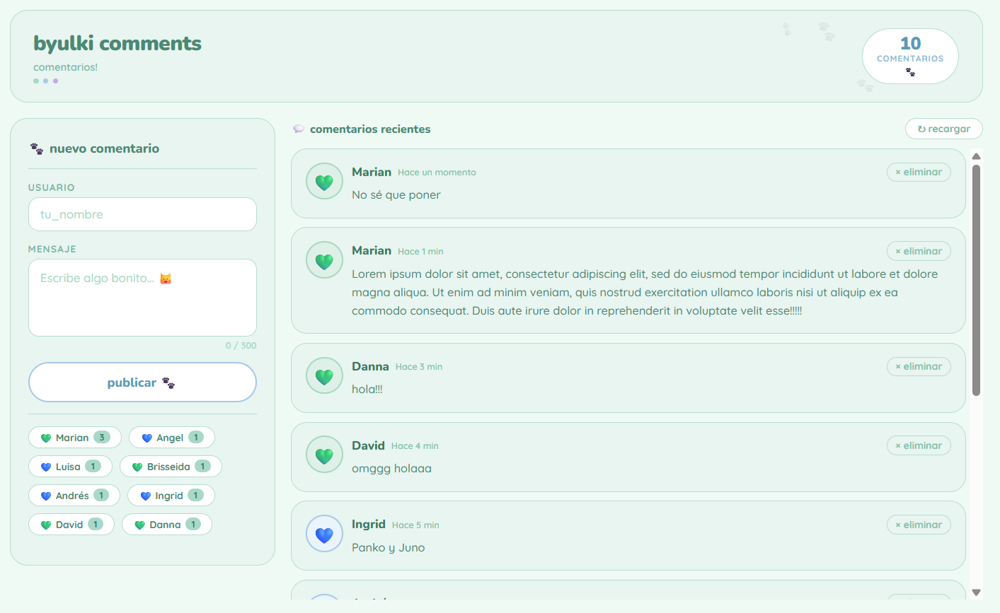
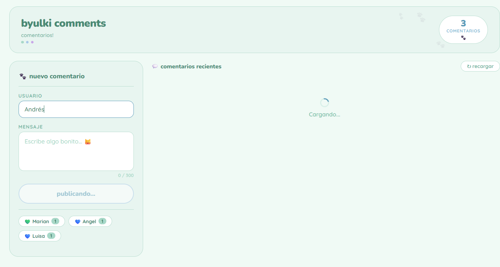
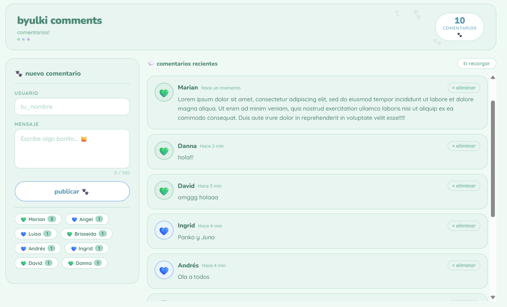
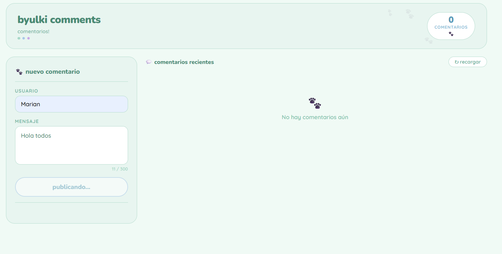
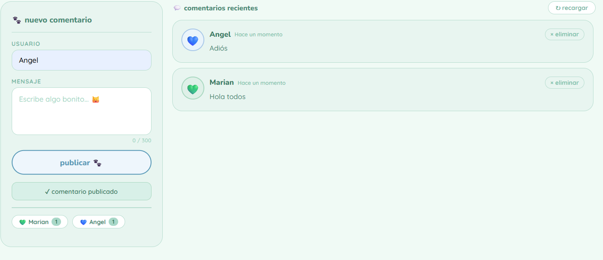
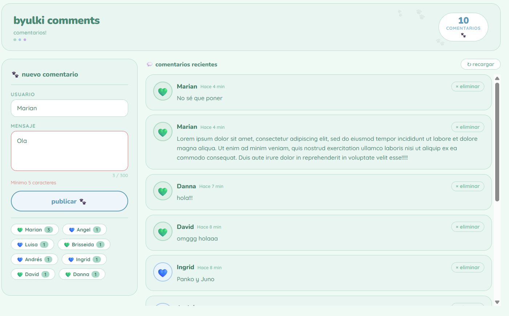
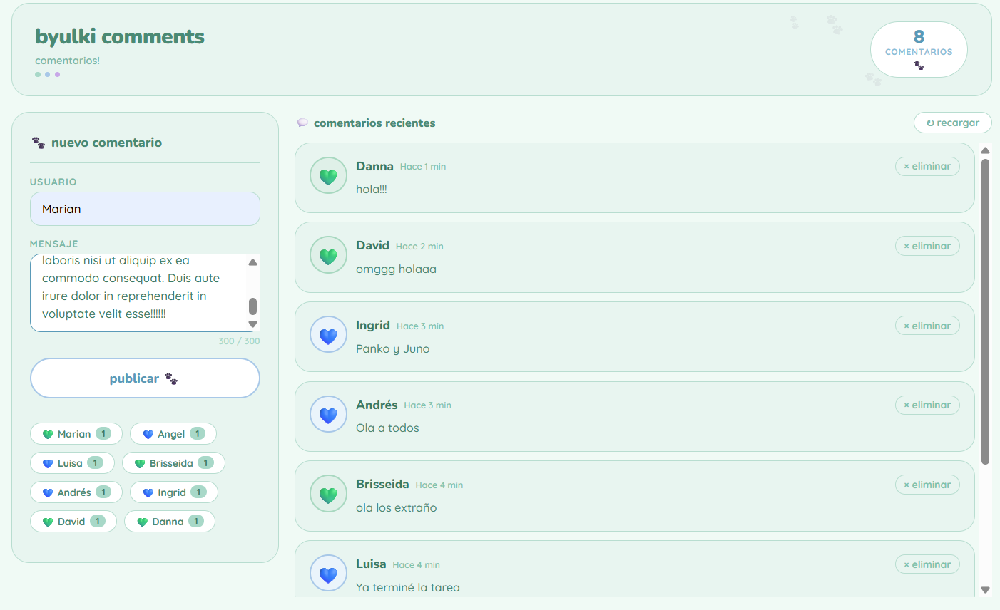
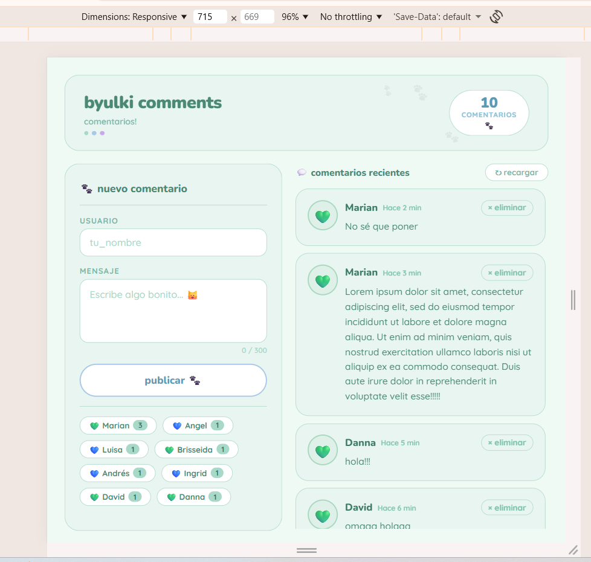

# byulkiComments

Interfaz web para consumir una API REST de comentarios. Permite publicar, ver y eliminar comentarios en un muro público. Construida con HTML, CSS y JavaScript.

## Página en línea
 
👉 **https://byulkicomments.onrender.com**

Si no carga, espere unos minutos y recargue la página en render. 

## Screenshots

### Página Principal


### Cargando comentarios


### Comentarios por persona


### Publicando comentarios



### Comentario publicado



### Minimo 5 caracteres



### Máximo 300 caracteres


### Responsividad


## Tecnologías
 
* HTML5
* CSS3
* JavaScript ES6
* JSON Server

## Instalación local

1. Clona o descarga el repositorio
2. Instala JSON Server: `npm install -g json-server`
3. Abre la terminal en la carpeta del proyecto y ejecuta: `json-server --watch db.json --port 3000`
4. Abre `index.html` con Live Server en VS Code 
## Configuración de la API
 
En `app.js`, la URL de la API se configura automáticamente según el entorno:
 
```js
const API = window.location.hostname === 'localhost'
  ? 'http://localhost:3000/comments'
  : 'https://byulkicomments.onrender.com/comments';
```
 
## Funcionalidades
 
* Cargar comentarios de todos los usuarios al iniciar (GET)
* Publicar comentarios con nombre y mensaje (POST)
* Eliminar comentarios (DELETE)
* Validación de nombre de usuario no vacío
* Validación de mínimo 5 caracteres en el mensaje
* Comentarios ordenados del más reciente al más antiguo
* Fecha relativa ("Hace 2 minutos") con fecha completa al hover
* Contador de comentarios por usuario
* Mensaje "No hay comentarios aún" cuando no hay comentarios
* Scroll automático si hay muchos comentarios
* Notificaciones de publicación y eliminación exitosa
* Confirmación antes de eliminar un comentario
* Diseño responsivo para móvil y escritorio
 
## Deploy en Render
La API está desplegada en Render como Web Service con Node.js.

* **Build Command:** `npm install`
* **Start Command:** `npm start`
* **URL:** https://byulkicomments.onrender.com